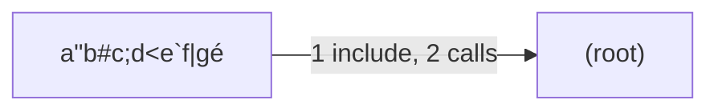

# A module map that parses

Labels use the entity codes of ADR-0017 for every character that is escaped.

```mermaid
flowchart LR
    m0["#40;root#41;"]
    m1["a#34;b#35;c#59;d#60;e#96;f#124;g#233;"]
    m1 -->|"1 include, 2 calls"| m0
```
